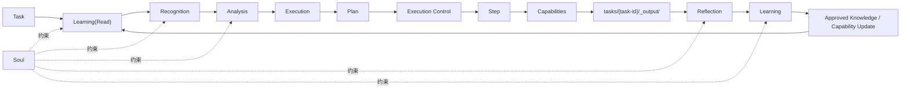
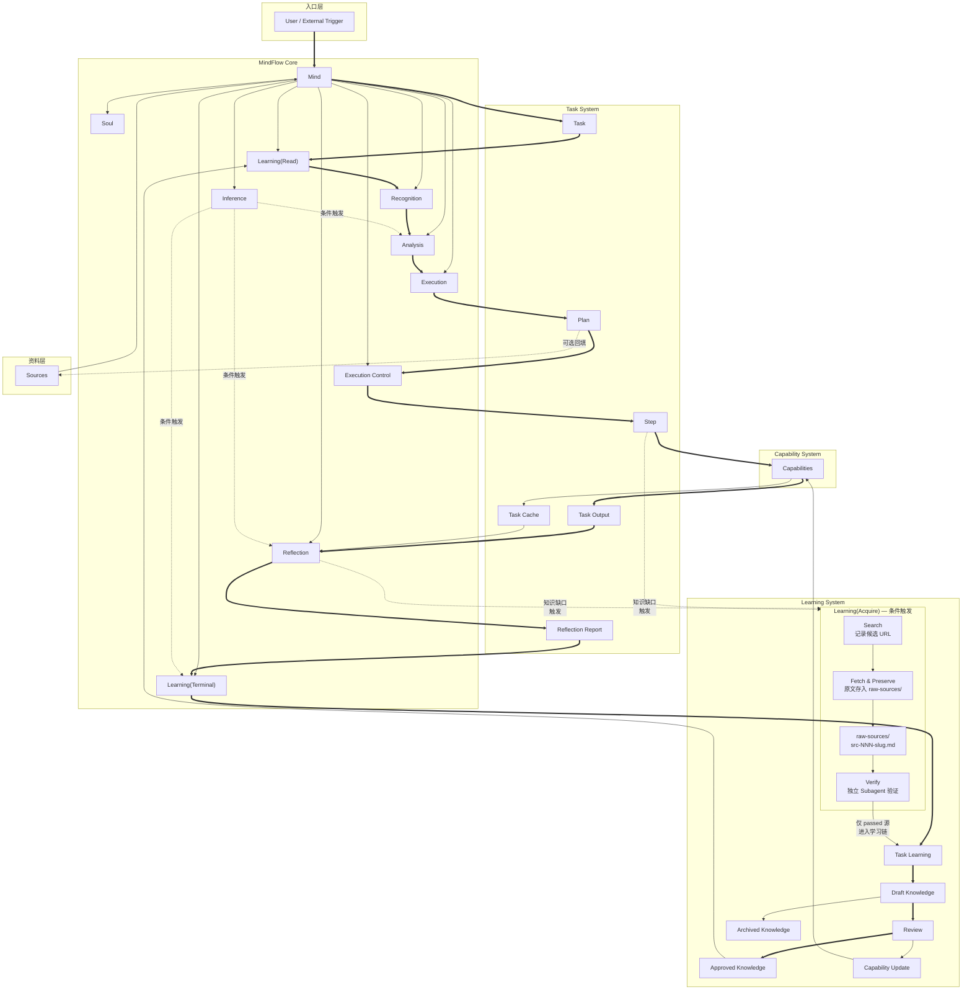

# MindFlow

[](https://doi.org/10.5281/zenodo.18977748)

[English](README.md) | 简体中文

MindFlow 是一个面向知识管理、认知演化与任务执行的 AI-native 自主决策系统。

它不是单纯的多智能体编排器，也不是一个普通知识库。它更像一个可被持续编辑的数字人格系统：你可以给它定义 `Soul`，让它吸收符合自身标准的方法论与工作方式，把学习内化成 `Capability`，再用这些能力去执行任务、反省结果、强化认知，并持续自我迭代。

当前这个代码仓库承载的是：

- 运行协议
- 目录规范
- 模块说明
- 文件模板
- 学习与审核链路

它不是一个已经内置自动执行器的成品应用，但它本身就是一个完整的系统设计。

## 它解决什么问题

个人和企业在知识管理与知识处理场景中，通常有这些共同问题：

- 方法论无法真正进入系统
  - 很多偏好、原则、工作办法只存在于人脑或零散文档里
- AI 很容易跑偏
  - 没有稳定约束时，AI 的输出会脱离个人或企业的标准
- 知识不会自动转成能力
  - 学到的内容常常停留在文档层，不能稳定复用
- 任务执行和知识沉淀是分裂的
  - 做完任务有结果，但没有把经验真正转成下次可调用的能力
- 普通 agent workflow 只会做事，不会按自身理念修正自己
  - 缺少可持续的学习、反省和认知强化机制

## 它是怎么解决的

MindFlow 的设计把整套系统拆成几个稳定层：

- `Soul`
  - 定义个人或企业的长期标准、偏好、禁忌和方法论取向
- `Learning`
  - 读取正式知识，并在任务后把候选知识推进到审核与固化链
- `Mind`
  - 负责识别、分析、执行、执行控制、反省、推衍等系统级认知过程
- `Capability`
  - 把学习结果内化成可执行能力组件
- `Plan + Step`
  - 把一次任务落成明确执行文件，并通过文件交接运行
- `Task State`
  - 把运行状态显式落盘，支撑失败恢复、并行汇合与断点续跑

所以它不是“先做任务，再顺便记点笔记”，而是要求系统按这套结构运行：

1. 先按自身 `Soul` 读取正式知识
2. 再由 `Mind` 识别并分析任务
3. 再生成正式 `Plan`
4. 再调用 `Capability` 执行
5. 最后复盘、学习、审核、固化，并形成能力升级

为了让真实运行稳定，MindFlow 还要求任务运行时维护一个正式状态面：

- 当前阶段是什么
- 当前 step 是什么
- 哪个 step 已完成、失败或阻塞
- 并行分支卡在哪个同步点
- 当前是否允许进入 `Reflection`

这里的 `Step` 不只支持顺序执行，也支持并行执行：

- 某些 `Step` 顺序运行
- 某些 `Step` 可以并行运行
- 并行时可以展开为多个并行 `Tasks` 或 `Subagents`
- 并行分支的结果仍然通过文件交接汇合

## 设计哲学

### 1. 先有 `Soul`，再有智能

MindFlow 不预设具体人格内容，但它要求你先定义一个 `Soul` 结构。

这样做的目的不是“做人格设定”，而是给系统一个不跑偏的最高约束层：

- 什么是好结果
- 什么方法更被偏好
- 什么不能做
- 什么值得学
- 什么结论不能进入系统

### 2. 学习不是存资料，而是内化为能力

在 MindFlow 里，学习的目标不是堆文档，而是让符合标准的知识最终变成 `Capability` 可调用的内容。

也就是说：

- 文档只是中间状态
- `Capability` 才是学习被执行化后的正式形态

### 3. 执行不是自由发挥，而是文件驱动

MindFlow 不依赖隐式上下文传递。

它要求：

- 任务有正式 `Plan`
- `Plan` 内部有多个 `Step`
- `Step` 之间通过 `cache/` 交接
- 最终结果进入 `_output/`

这样才能让任务可复盘、可审计、可重跑、可约束。

### 4. 反省不是总结，而是认知强化

执行完成后，系统必须进入 `Reflection -> Learning`。

这一步的目标不是写一篇总结，而是：

- 发现问题
- 识别值得学习的内容
- 发现能力缺口
- 强化认知与能力
- 防止系统脱离现实后持续放飞自我

所以 MindFlow 本质上是一个带自我修行机制的任务系统。

## 为什么这里要用 MAS

MindFlow 的执行层本质上是 MAS。

原因不是为了“多智能体看起来更高级”，而是因为很多真实任务天然是多能力协同问题：

- 有的能力负责研究
- 有的能力负责结构化整理
- 有的能力负责执行具体动作
- 有的能力负责检查结果

把这些能力拆成多个 `Capability`，并由 `Plan + Step` 去调度，有几个优势：

- 能力边界清楚
- 单个能力更容易维护
- 任务拆解后更稳定
- 能通过文件交接避免上下文污染
- 更适合在任务后做局部反省和能力升级

同时，`Plan` 并不要求所有 `Step` 都串行。
当任务适合并行时，`Step` 可以并行展开，从而提升复杂任务的执行效率。

所以，MindFlow 不是“先有 MAS，再找场景”，而是“因为知识问题和复杂任务天然需要能力分工，所以执行层采用 MAS”。

## 主流程

如果你按 MindFlow 的协议运行任务，每个任务都必须经过这条主流程：

`Task -> Learning(Read) -> Recognition -> Analysis -> Execution -> Plan -> Execution Control -> [Learning(Acquire)?] -> Reflection -> [Learning(Acquire)?] -> Learning`

含义如下：

- `Learning(Read)`
  - 读取经过审核并固化的正式知识
- `Recognition`
  - 识别任务并产出 `Task Profile`
- `Analysis`
  - 拆解任务并产出 `Analysis Output`
- `Execution`
  - 产出正式 `Plan`
- `Execution Control`
  - 按 `Plan` 推进 `Step`
  - 管理串行、并行、汇合与失败处理
- `Plan`
  - 组织多个 `Step`
- `Step`
  - 调用不同 `Capability` 执行
  - 可以顺序执行，也可以并行执行
- `Reflection`
  - 对本次任务进行复盘，产出 `Reflection Report`
- `Learning`
  - 把任务经验推进到学习链，最终固化为正式知识或能力升级

## 流程图



上图描述的是任务如何流经系统，所以它是流程图，不是架构图。

## 输出与资料

按当前仓库定义，MindFlow 使用两个不同的落点：

- 默认任务结果目录：`tasks/{task-id}/_output/`
- 可选回填目录：`sources/`

规则是：

- 系统流程默认依赖 `_output/`
- `Reflection` 默认读取 `_output/`
- 只有当 `Plan` 明确声明时，结果才允许同步写回 `sources/`

这意味着：

- `_output/` 是任务内部正式结果位
- `sources/` 是业务资料和对外沉淀位

## 目录结构

```text
MindFlow/
├── README.md
├── README-CN.md
├── SYSTEM.md
├── CLAUDE.md
├── mind/
│   ├── soul/
│   ├── recognition/
│   ├── analysis/
│   ├── execution/
│   ├── execution-control/
│   ├── reflection/
│   ├── learning/
│   │   ├── learning-read/
│   │   ├── knowledge-base/
│   │   │   ├── approved/
│   │   │   ├── drafts/
│   │   │   └── archived/
│   │   ├── task-learning/
│   │   ├── reviews/
│   │   └── capability-updates/
│   └── inference/
├── capabilities/
├── sources/
└── tasks/
```

## 架构图



这张图描述的是系统里的核心概念层如何组成整体结构，以及 `Mind` 如何统领各核心模块并与任务系统、能力系统、学习系统和资料层发生关系，所以它才是架构图。

## 目录说明

### `mind/`

定义整个系统的运行模块：

- `soul/`
  - 系统最高约束层
- `recognition/`
  - 识别任务
- `analysis/`
  - 拆解任务与能力需求
- `execution/`
  - 生成正式 `Plan`
- `execution-control/`
  - 按 `Plan` 推进 `Step`、管理并行与汇合
- `reflection/`
  - 任务后复盘
- `learning/`
  - 知识读取、知识沉淀、审核、能力更新
- `inference/`
  - 条件触发的推衍模块

### `capabilities/`

定义动作能力。

每个 `Capability` 只负责一个核心动作，并通过文件输入输出工作。

### `sources/`

存放工程资料：

- 原始资料
- 参考资料
- 外部输入
- 按 `Plan` 回填的最终交付物

### `tasks/`

存放任务实例目录。

每个任务至少包含：

- `learning-read.md`
- `state.md`
- `task-profile.md`
- `analysis.md`
- `plan.md`
- `reflection-report.md`
- `_output/`
- `cache/`

当存在并行 `Step` 时：

- 并行 `Step` 仍然属于同一个 `Plan`
- 各并行分支仍然共享同一个任务目录
- 分支之间不能依赖隐式上下文，仍然必须通过文件交接

## 知识如何进入系统

知识不能直接写入正式知识区。

必须按这条路径推进：

`reflection-report.md -> tl-{task-id}.md -> draft-*.md -> review-*.md -> kb-*.md -> cu-*.md`

含义：

- `tl-*`
  - 任务级学习记录
- `draft-*`
  - 待审核知识草稿
- `review-*`
  - 审核记录
- `kb-*`
  - 已批准正式知识
- `cu-*`
  - 能力更新记录

只有进入 `mind/learning/knowledge-base/approved/` 的知识，才允许被未来任务读取。

## 它和普通系统有什么不同

MindFlow 不是：

- 普通知识库
- 普通 workflow 引擎
- 普通 agent prompt 集合
- 纯粹的 MAS 编排器

它的区别在于：

- 有 `Soul`
  - 能承载个人或企业标准
- 有正式学习链
  - 不是把经验随便记下来
- 有能力内化机制
  - 学习最终会转成 `Capability`
- 有反省机制
  - 执行完成后会复盘并强化认知与能力
- 有自主决策能力
  - 不是只按单次命令响应，而是按系统标准持续演化

## 这个仓库当前实现了什么

当前仓库已经实现的是：

- `README*`
  - 面向使用者的总览文档
- `SYSTEM.md`
  - 面向 AI 的系统协议
- `CLAUDE.md`
  - 面向 AI 的运行约束
- `mind/*`
  - 各模块说明与模板
- `capabilities/*`
  - `Capability` 定义规范
- `tasks/*`
  - 任务目录规范
- `sources/*`
  - 工程资料规范
- `mind/learning/*`
  - 学习、审核、批准、能力更新的固定链路

当前仓库没有内置的是：

- 自动执行器代码
- 调度程序
- 实际模型调用实现

所以这份仓库现在更准确地说，是 MindFlow 这套系统的协议层、结构层和运行层定义。

## 如何开始使用

1. 定义你的 `Soul`
   - 进入 `mind/soul/` 按模板填写
2. 定义你的 `Capabilities`
   - 进入 `capabilities/` 按模板编写
3. 放入你的资料
   - 放入 `sources/`
4. 创建任务目录
   - 在 `tasks/{task-id}/` 中生成任务产物
5. 按主流程运行
   - 从 `Learning(Read)` 开始，走完整条链
   - 由你的 AI 运行环境或执行器去遵守这些协议

## 入口文件分别做什么

- [README-CN.md](/Users/weili.wang/workspace/mamas/README-CN.md)
  - 面向使用者的中文总览
- [README.md](/Users/weili.wang/workspace/mamas/README.md)
  - 面向使用者的英文总览
- [SYSTEM.md](/Users/weili.wang/workspace/mamas/SYSTEM.md)
  - 面向 AI 的系统协议
- [CLAUDE.md](/Users/weili.wang/workspace/mamas/CLAUDE.md)
  - 面向 AI 的运行约束
