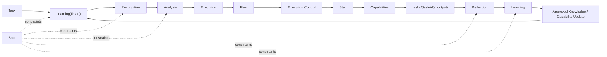
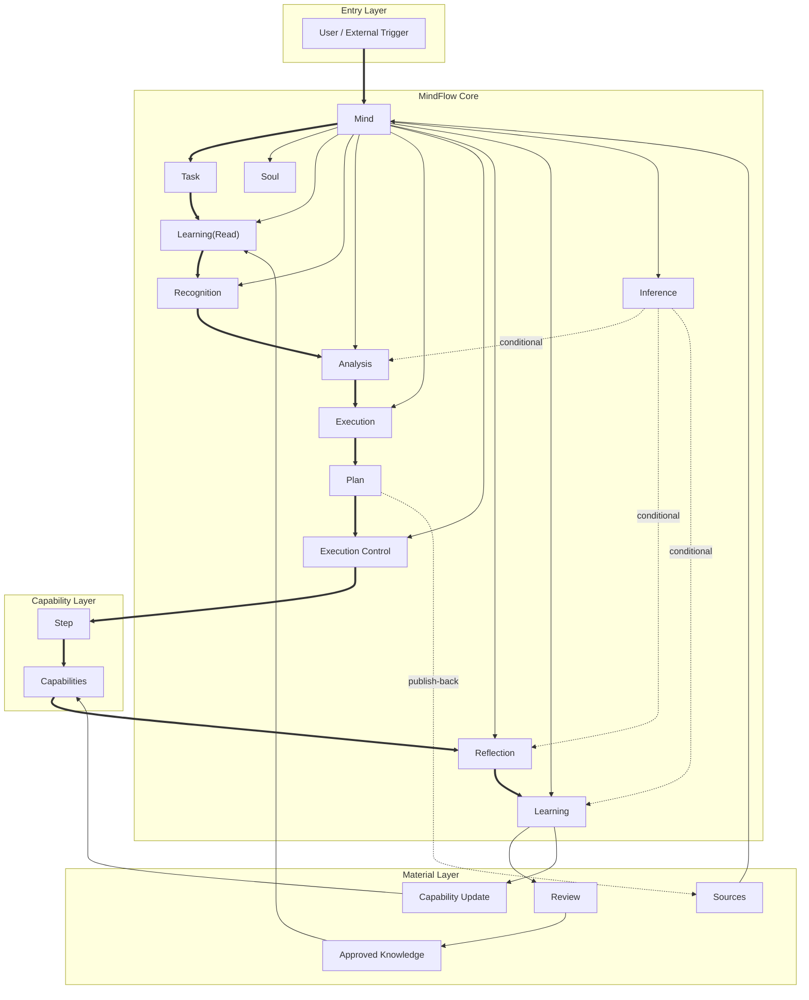

# MindFlow

[Simplified Chinese](README-CN.md) | English

MindFlow is an AI-native autonomous decision system for knowledge management, cognitive evolution, and task execution.

It is not just a multi-agent orchestrator, and it is not just a knowledge base. It is closer to an editable digital persona system: you define a `Soul`, let the system absorb methodology and working styles that match your standards, internalize them into `Capability` components, execute work through those capabilities, reflect on outcomes, strengthen cognition, and keep evolving without drifting away from your own principles.

This repository currently provides:

- runtime protocol
- directory rules
- module documentation
- file templates
- learning and review promotion paths

It is not a finished application with a built-in automatic executor, but it is still a complete system design.

## The Problem

Individuals and organizations usually face the same problems in knowledge work:

- methodology never truly enters the system
  - important preferences, principles, and ways of working stay in people’s heads or scattered documents
- AI drifts easily
  - without stable constraints, output drifts away from personal or organizational standards
- knowledge does not automatically become capability
  - what gets learned often remains documentation instead of becoming reusable execution units
- task execution and knowledge accumulation are disconnected
  - work gets done, but the experience does not become the next stable capability
- ordinary agent workflows can execute, but they do not self-correct under a stable philosophy
  - there is no durable mechanism for learning, reflection, and cognitive strengthening

## The Solution

MindFlow is designed as a set of stable layers:

- `Soul`
  - defines long-term standards, preferences, taboos, and methodological direction
- `Learning`
  - reads formal knowledge before work and pushes new knowledge through a reviewed promotion path after work
- `Mind`
  - owns system-level cognition such as recognition, analysis, execution, execution control, reflection, and inference
- `Capability`
  - turns learning outcomes into executable components
- `Plan + Step`
  - turns a task into a formal execution file and runs through file-based handoff
- `Task State`
  - persists runtime state so recovery, parallel merge, and resumption are controllable

So the intended system behavior is not “do a task and maybe write some notes after.”

Instead it works like this:

1. read formal knowledge under the guidance of `Soul`
2. recognize and analyze the task through `Mind`
3. generate a formal `Plan`
4. execute through `Capability` units
5. reflect, learn, review, consolidate, and upgrade capability

For stable real execution, MindFlow also requires a formal runtime state surface:

- what phase the task is currently in
- which step is currently active
- which steps are completed, failed, or blocked
- where parallel branches are waiting to merge
- whether the task is ready to enter `Reflection`

`Step` does not only support sequential execution. It also supports parallel execution:

- some `Step`s run sequentially
- some `Step`s may run in parallel
- parallel branches may expand into multiple concurrent `Tasks` or `Subagents`
- the results of parallel branches still converge through file-based handoff

## Design Philosophy

### 1. `Soul` comes before intelligence

MindFlow does not pre-fill a worldview, but it requires a `Soul` structure first.

The purpose is not roleplay. The purpose is to give the system a highest constraint layer:

- what counts as a good result
- which methods are preferred
- what must not be done
- what is worth learning
- what must never be promoted into the system

### 2. Learning is not document storage, it becomes capability

In MindFlow, the goal of learning is not to pile up documents.
The goal is for approved knowledge to eventually become callable capability.

That means:

- documents are intermediate states
- `Capability` is the formal executable shape of learning

### 3. Execution is file-driven, not improvisational

MindFlow does not rely on implicit context passing.

It requires:

- a formal `Plan`
- multiple `Step`s inside the plan
- file handoff through `cache/`
- final results written into `_output/`

This makes tasks reviewable, auditable, reproducible, and constrainable.

### 4. Reflection is cognitive strengthening, not just summary

After execution, the system must enter `Reflection -> Learning`.

This is not just for writing a summary. It is for:

- detecting problems
- identifying what is worth learning
- discovering capability gaps
- strengthening cognition and capability
- preventing the system from drifting away from reality over time

MindFlow is therefore a task system with a built-in self-cultivation loop.

## Why MAS Matters Here

The execution layer of MindFlow is effectively MAS.

Not because “multi-agent” sounds advanced, but because real knowledge work naturally requires multiple kinds of capability:

- some capabilities research
- some structure information
- some perform concrete actions
- some evaluate outputs

Breaking work into multiple `Capability` units coordinated by `Plan + Step` gives practical advantages:

- clear capability boundaries
- easier maintenance of each unit
- more stable task decomposition
- less context contamination through file-based handoff
- better local reflection and capability upgrade after each task

`Plan` therefore does not require all `Step`s to be serial.
When the task fits parallelization, `Step`s may run in parallel to improve execution efficiency for complex work.

So MindFlow is not “MAS first, then find a use case.”
It is “knowledge work naturally requires capability division, so the execution layer uses MAS.”

## Core Flow

When a task is run under the MindFlow protocol, it must follow this flow:

`Task -> Learning(Read) -> Recognition -> Analysis -> Execution -> Plan -> Execution Control -> Reflection -> Learning`

This means:

- `Learning(Read)`
  - reads approved and consolidated formal knowledge
- `Recognition`
  - identifies the task and produces `Task Profile`
- `Analysis`
  - decomposes the task and produces `Analysis Output`
- `Execution`
  - produces the formal `Plan`
- `Execution Control`
  - advances `Step`s according to the formal `Plan`
  - manages serial execution, parallel execution, merge, and failure handling
- `Plan`
  - organizes multiple `Step`s
- `Step`
  - calls different `Capability` units
  - may run sequentially or in parallel
- `Reflection`
  - reviews the completed task and produces `Reflection Report`
- `Learning`
  - moves task experience into the learning pipeline, eventually forming formal knowledge or capability updates

## Flow Diagram



The diagram above shows how a task flows through the system, so it is a flow diagram, not the architecture diagram.

## Outputs and Materials

Under the current repository rules, MindFlow uses two different result locations:

- default task result directory: `tasks/{task-id}/_output/`
- optional publish-back directory: `sources/`

Rules:

- the system flow depends on `_output/`
- `Reflection` reads `_output/` by default
- writing back to `sources/` is only allowed when explicitly declared in `Plan`

That means:

- `_output/` is the formal internal task result location
- `sources/` is the business material and publication location

## Directory Structure

```text
MindFlow/
├── README.md
├── README-CN.md
├── SYSTEM.md
├── CLAUDE.md
├── mind/
│   ├── soul/
│   ├── recognition/
│   ├── analysis/
│   ├── execution/
│   ├── execution-control/
│   ├── reflection/
│   ├── learning/
│   │   ├── learning-read/
│   │   ├── knowledge-base/
│   │   │   ├── approved/
│   │   │   ├── drafts/
│   │   │   └── archived/
│   │   ├── task-learning/
│   │   ├── reviews/
│   │   └── capability-updates/
│   └── inference/
├── capabilities/
├── sources/
└── tasks/
```

## Architecture



The diagram above is the architecture diagram. It shows the structural relationship between the core concepts, systems, and artifact layers.

## How to Use This Repository

This repository is intended for people or organizations who want to define their own knowledge system, runtime rules, learning chain, and capability evolution mechanism.

Typical usage:

1. define `Soul` in `mind/soul/core.md`
2. define or extend `Capability` files under `capabilities/`
3. place project materials in `sources/`
4. create `tasks/{task-id}/`
5. run the task according to the formal MindFlow protocol
6. let task-end `Learning` promote reusable knowledge and capability updates

## What Makes It Different

MindFlow is different from the following common systems:

- a plain knowledge base
  - because it does not stop at storage; it turns approved learning into executable capability
- a plain workflow engine
  - because it is constrained by `Soul` and has built-in reflection and learning promotion
- a plain agent loop
  - because it uses formal artifacts, runtime state, file-based handoff, and a review-controlled promotion path
- a multi-agent orchestrator for its own sake
  - because MAS is only the execution layer, not the identity of the whole system
