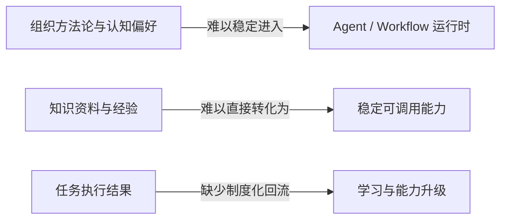
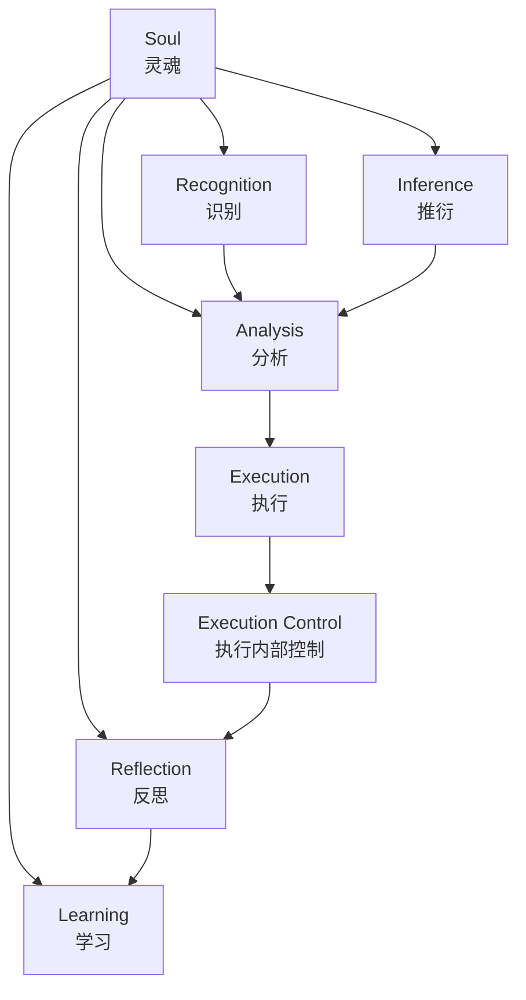
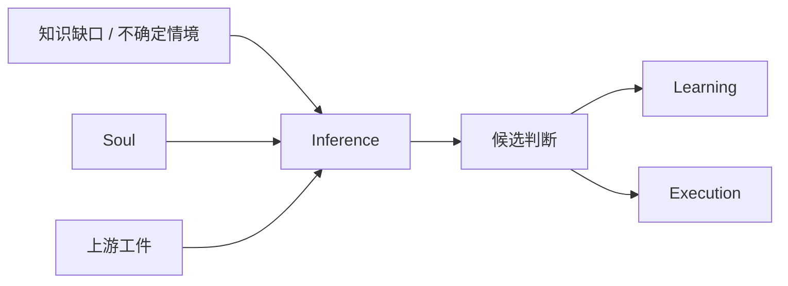
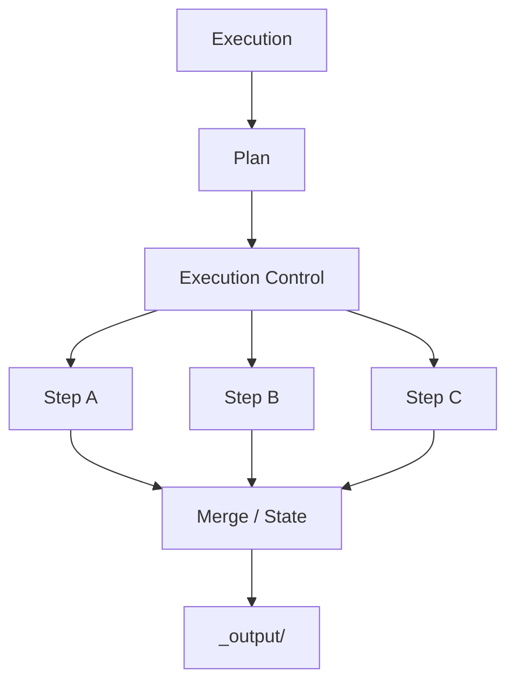
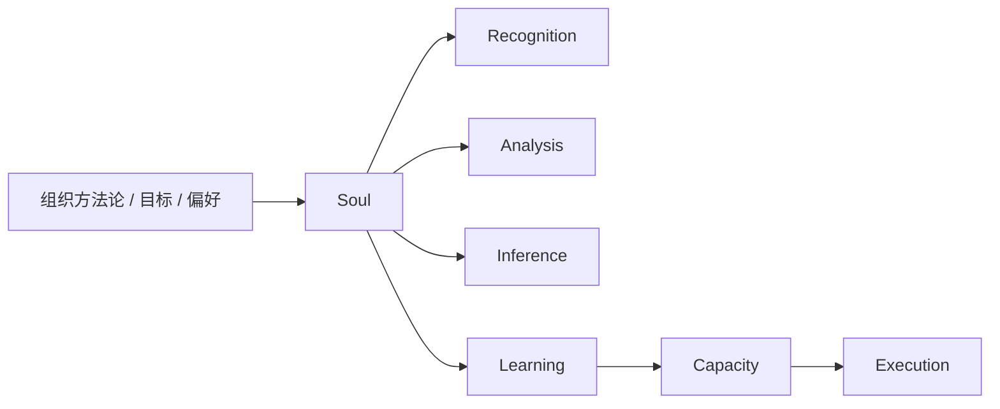

# 面向组织场景的 AI-Native 方法论与知识管理一体化框架研究

作者：Neil Wang（王唯力）

# 摘要 {.unnumbered}

在组织场景中，现有 AI 系统虽然已经表现出较强的任务执行能力，但在方法论继承、知识沉淀、能力内化、目标一致性与可控自主演进方面仍存在显著断裂。大量工作流式 Agent 系统能够完成局部任务，却难以稳定地将组织的方法论原则、认知偏好与发展目标引入运行时，也难以将任务过程中的知识增量转化为可复用能力。针对上述问题，本文提出一种面向组织场景的 AI-native 方法论与知识管理一体化框架，并以 MindFlow 作为其协议化实现载体。本文首先将 `Mind` 定义为一个由 `Soul`、`Recognition`、`Analysis`、`Execution`、`Reflection`、`Learning` 与 `Inference` 七层共同构成的核心认知主体，进而论证 `Soul` 作为高层约束层在组织目标一致性中的作用，说明心智模型如何作为认知方法论偏好的形式化表达参与系统运行。随后，本文提出“软件工程本质上是一种知识工程”的理论判断，并进一步讨论在 AI 软件条件下“知识可执行”的结构性含义，即知识能够以 `Skill`、`Capacity` 等形式直接进入运行与决策，从而重新界定传统软件中固定执行封装层的边界。最后，本文通过主流程分析、机制建模、案例路径说明与范式对比，论证 MindFlow 相较于普通 Agent workflow、传统 MAS 编排系统与传统知识管理系统的理论增量。研究表明，只有当高层方法论约束、知识管理、能力形成、执行协议与反思学习被统一纳入同一体系时，AI 系统才可能获得可控、有目标导向且可持续自我修正的自主决策与学习能力。

# 关键词 {.unnumbered}

AI-Native；方法论；知识管理；知识工程；心智模型；数字人格；自主决策；自主学习

# 引言

大语言模型推动的软件形态变化，并不只体现为生成能力增强，更体现在知识、认知与执行之间关系的重组。传统软件系统通常通过预定义功能、固定界面与刚性流程来封装知识，而当前大量 Agent 系统则尝试将模型能力嵌入任务流程，使其具备更强的自动化与交互能力。然而，当这些系统进入组织场景之后，新的问题迅速显现出来。系统可以完成任务，但它未必真正继承了组织的方法论；系统可以读取知识，但它未必把知识稳定沉淀为能力；系统可以在局部任务中表现出智能，但它未必能够在长期运行中保持目标一致性、方法稳定性与可控自主演进。

上述问题的关键，并不在于“模型还不够强”，而在于现有系统设计仍然倾向于把知识、执行、学习与治理拆散处理。许多工作流式 Agent 系统关注的是任务是否完成，却较少处理高层方法论如何进入运行时；许多知识管理系统擅长存储、检索与组织资料，却不天然解决知识如何成为执行能力；许多多智能体编排方案擅长把复杂任务拆分为多个步骤，却往往缺少稳定的反思学习闭环。这意味着，组织真正需要的不仅是“会做事的 AI”，而是“在组织约束下能够持续学习、保持方向并沉淀能力的 AI”。

MindFlow 提供了一个值得进一步理论化的对象。它并不将自己定位为单纯多智能体编排器，也不将自己定位为简单知识库，而是试图把 `Soul`、`Mind`、`Capability`、`Plan + Step`、`Task State` 与 `Reflection -> Learning` 闭环统一在一个 AI-native 自主决策系统中 [1]。这一点意味着，MindFlow 更适合被理解为一种方法论框架的协议化表达，而非单一工程工具。它试图解决的核心问题不是“如何让 Agent 跑起来”，而是“如何让方法论真正进入系统，如何让知识真正变成能力，如何让执行与学习在组织目标约束下形成闭环”。

本文的基本判断是，软件工程在更深层意义上本质上是一种知识工程。传统软件可以被看作知识经由流程化、结构化与功能封装后的表达形式；而在 AI 软件条件下，知识开始通过 `Skill`、`Capacity` 等形式直接参与系统运行，从而使“知识可执行”成为一种新的软件边界。围绕这一判断，本文试图回答如下问题：面向组织场景的 AI 系统，如何把高层方法论约束、认知偏好、知识管理、能力沉淀与任务执行统一为一套可解释、可运行、可反思、可持续演进的方法论体系。

基于上述问题意识，本文的研究贡献主要体现在四个方面。第一，本文提出 `Mind` 作为 AI-native 方法论核心体的形式化定义，并将其表达为由 `Soul`、`Recognition`、`Analysis`、`Execution`、`Reflection`、`Learning` 与 `Inference` 七层构成的核心认知主体。第二，本文提出一种面向组织场景的高层约束进入运行时的解释框架，说明方法论原则、认知偏好与发展目标如何通过 `Soul` 与心智模型持续塑造系统行为。第三，本文讨论“知识可执行”对 AI 软件形态与知识管理体系的结构性影响，指出知识在 AI 软件中正从静态说明层转向可调用、可验证、可组合的执行单元。第四，本文以 MindFlow 为载体，通过主流程分析、机制建模、案例路径与范式比较，论证该框架相较于普通 Agent workflow、传统 MAS 编排与传统知识管理系统的理论增量。

# 相关研究与问题提出

围绕本文主题，至少有四类研究传统与之密切相关。第一类是 Agent 与多智能体系统研究。相关综述表明，近期基于大语言模型的 autonomous agents 与 multi-agent systems 已经形成相对清晰的方法论讨论，包括任务分解、工具使用、协作结构与应用范式 [12][18]。然而，这一研究方向的重心通常放在代理如何完成任务、如何协作、如何使用工具，而较少将组织层面的高层约束、知识沉淀与长期自主演进作为统一问题展开。

第二类是知识管理与组织学习研究。相关研究长期指出，组织并不是通过简单存储资料来形成能力，而是通过知识筛选、保留、转移与嵌入稳定流程来产生价值 [8][10]。系统综述进一步表明，组织学习中的知识创建与获取过程，事实上已经在概念上被知识管理研究所吸收 [9]。这意味着，如果希望 AI 系统真正适配组织场景，就不能将知识管理视为外部附属模块，而应当把知识形成、审核、沉淀与能力化视为系统结构的一部分。

第三类是认知架构研究。认知架构传统强调，认知系统不应被理解为零散算法集合，而应被理解为多个认知过程之间的有机关联 [11][14][15]。这一视角对于本文具有重要意义，因为它提供了一种超越工程实现细节的表达方式，使 `Mind` 可以被写成方法论核心体，而不是简单的目录树或模块列表。特别是当本文进一步讨论 `Inference`、心智模型与数字人格时，认知架构传统有助于避免这些概念滑向泛泛而谈或修辞化表达。

第四类是知识工程与 AI 软件研究。知识工程的经典工作长期强调知识系统设计、知识库维护和知识表示的统一性 [6][7]。近期研究则进一步将软件工程与知识工程直接联系起来，提示软件系统的设计、维护与演进可以被重新理解为知识结构化与知识流动的问题 [17]。这一点为本文提出“软件工程本质上是一种知识工程”提供了直接理论支撑，也为“知识可执行”这一命题奠定了讨论基础。

尽管上述研究传统分别提供了多智能体协作、组织知识处理、认知系统设计与知识工程的丰富资源，但它们之间仍存在明显空白。Agent 研究缺少稳定的组织约束与能力沉淀视角；知识管理研究通常不直接处理 AI 系统如何把知识转化为执行能力；认知架构研究较少进入组织知识管理与软件工程语境；AI 软件研究则经常停留在工具或产品层，而缺乏上位方法论整合。本文的切入点正位于这些空白的交叉处：它试图提出一种将组织场景、高层约束、知识管理、认知架构与 AI 软件形态统一起来的方法论框架。

图 1 给出了本文的问题断裂示意。该图的意图不是概括所有既有研究，而是标出本文真正试图修复的三个结构性断口，即高层方法论约束难进入运行时、知识难内化为稳定能力，以及执行与学习之间缺少闭环。

图 1 现有主流范式中的三类结构性断裂

# 核心概念与理论命题

本文首先将 `Mind` 定义为系统的核心认知主体。它不是单一模块，而是由 `Soul`、`Recognition`、`Analysis`、`Execution`、`Reflection`、`Learning` 与 `Inference` 七层共同构成的 AI-native 方法论核心体。上述七层分别承担高层约束、任务理解、问题拆解、行动实施、结果复盘、知识内化与受控推衍等职责，它们共同决定系统如何理解任务、如何形成判断、如何学习、如何保持方向一致性。

需要特别指出的是，`Execution Control` 不属于 `Mind` 七层本体 [2]。但更准确地说，它也不应被写成与 `Execution` 并列的外部协议层，而应被理解为 `Execution` 内部的运行控制与调度机制。若将其直接并入 `Mind`，容易把认知结构与执行调度混为一谈；若将其完全外置，又会遮蔽其与 `Execution` 的内在从属关系。`Mind` 的重点在于认知与方法论结构，`Execution` 的重点在于把分析结果转化为可推进的行动形式，而 `Execution Control` 则是这一执行阶段内部负责依据 `Plan` 推进步骤、协调并行任务、管理状态同步与结果汇合的控制部分 [5]。

`Soul` 是本文最关键的概念之一。根据 MindFlow 一手定义，`Soul` 是 `Mind` 的最高约束层，它并不直接执行任务，也不直接产生业务结果，而是持续提供长期稳定约束 [3]。这意味着，`Soul` 的价值不在于塑造一种文学意义上的人格，而在于将组织的方法论原则、认知偏好、边界条件与发展目标形式化为系统的最高治理层。在组织场景中，只有当“什么算好结果”“什么方法被偏好”“什么不允许发生”“什么值得学习”这些问题被上升到 `Soul` 层，系统的学习与演进才可能保持目标一致性。

与 `Soul` 紧密相连的是心智模型。本文将心智模型界定为认知方法论偏好的形式化表达，它回答系统在不同情境下采用何种判断策略、如何在不确定性中进行取舍、偏好学习什么样的知识以及朝何种方向演进。换言之，心智模型并不是一个独立模块，而是组织在认知层面对系统施加的方法论形状。它使系统的自我提升不再是任意生长，而是朝向组织目标展开的可控演进。

`Inference` 是本文另一个必须单列讨论的概念。MindFlow 的一手定义指出，`Inference` 并不是默认长期激活的步骤，其输出默认是暂时性的，且在执行前必须读取 `Soul` 及其上游触发工件 [4]。这意味着，本文所说的推衍并不是自由联想式推理，而是受约束的结构化推衍机制。其价值至少体现在四个方面：在知识不完整时维持连续决策、为学习提供方向性判断、支撑风险预判与路径比较，以及在未知条件下保持数字人格的一致性。没有 `Inference`，系统只能在已知知识范围内机械执行；有了 `Inference`，系统才具备在约束下继续前进的能力。

在此基础上，本文提出两个相互关联的高层命题。其一，软件工程本质上是一种知识工程 [6][7][17]。传统软件系统可以被理解为知识经过抽象、流程化、结构化和功能封装之后形成的执行形态。其二，在 AI 软件条件下，知识开始变得可执行。这里的“知识可执行”，不是指资料能够被搜索到，而是指知识可以通过 `Skill`、`Capacity` 等形式直接进入运行过程，成为可调用、可验证、可组合的执行单元。由此，知识不再只是支撑软件的静态说明层，而开始承担部分原本由固定代码封装承担的执行职责。

最后，本文将数字人格定义为一种具备约束、偏好、学习、推衍与持续演进能力的 AI 软件形态。这一概念并非修辞性的拟人化说法，而是指一种更接近认知主体的软件结构。与传统固定功能软件相比，这种系统并不只是被动响应输入，而是在组织场景约束下持续理解、判断、学习并形成长期稳定风格。MindFlow 的理论潜力，正是在于它为这种数字人格化的 AI 软件提供了一个可协议化表达的结构。

图 2 对 `Mind` 七层结构及其与 `Execution Control` 的边界进行了概括。该图的关键不在于展示目录树，而在于明确：`Mind` 是认知主体本身，`Execution Control` 属于 `Execution` 内部的运行控制部分，而不是 `Mind` 的独立层级。

图 2 Mind 七层与 Execution 内部控制边界示意

# Mind 方法论框架

从方法论角度看，`Mind` 七层并不是若干模块的简单堆叠，而是一个相互制约、相互生成的有机整体。`Soul` 作为最高约束层规定系统的长期方向；`Recognition` 将外部任务和环境转化为系统可理解的问题对象；`Analysis` 对识别结果进行结构化建模；`Execution` 将认知结果转化为行动；`Reflection` 对行动结果进行再解释；`Learning` 将可保留内容沉淀为稳定知识；`Inference` 则在知识不完备条件下提供推衍能力。这些层级之间并非线性单向关系，而是构成一个受约束的认知闭环。

首先，`Soul` 的位置决定了该框架与普通 Agent workflow 的本质差异。普通 workflow 往往在 prompt、规则或人工习惯中隐含价值倾向，而 MindFlow 将这些内容显式上升为一个可持续引用的约束层 [3]。这意味着“偏好何种方法”“允许何种学习路径”“如何判断结果是否符合组织目标”等问题，不再以零散、临时、口头化的形式散落在系统周围，而是成为系统结构本身的一部分。

其次，`Recognition` 与 `Analysis` 的组合说明任务理解不应被省略。很多 Agent 流程倾向于接收任务后直接调用工具或执行模板，但组织场景中的复杂任务往往要求先判断任务类型、复杂度、风险、知识缺口与能力需求，再进行问题拆解和路径设计。若缺少这一层，执行只能是局部自动化，而无法构成稳定的方法论行为。

再次，`Learning` 与 `Capacity` 的关系决定了该框架与传统知识管理系统的差异。组织知识管理研究早已表明，知识价值的关键不在于存储本身，而在于它是否进入组织稳定流程并产生价值 [8][10]。MindFlow 将这一逻辑进一步推进：知识不仅要被保留，还要通过学习、审核与能力化过程，最终形成稳定可调用的 `Capacity`。这一设计使“知识管理”不再只是文档归档，而成为执行能力生产机制的一部分。

最后，`Inference` 的引入使该框架能够面对不确定性。组织场景中的任务很少完全处于知识完备状态，系统必须在知识缺口、风险与多路径选择中持续前进。此时，如果没有受约束推衍机制，系统要么停滞，要么走向无边界即兴发挥。MindFlow 的处理方式是，让 `Inference` 在 `Soul` 与上游工件约束下形成候选判断，再由 `Learning` 与后续执行对这些判断进行稳定化或修正 [4]。这使系统既保留前进能力，又不至于失去治理边界。

图 3 受约束推衍机制示意

# 主流程与运行逻辑

MindFlow 的正式流程为：`Task -> Learning(Read) -> Recognition -> Analysis -> Execution -> Plan -> Execution Control -> Reflection -> Learning` [1][2]。这里的 `Execution Control` 应理解为 `Execution` 阶段内部的控制机制，而不是与 `Execution` 平行的独立认知层级。整个流程并不只是工程步骤列表，而是对“一个具备方法论约束的认知主体如何解决问题”的形式化表达。

首先，任务并不是直接触发执行，而是先进入 `Learning(Read)`。这一步意味着系统在行动之前，先读取 `Soul` 以及已审核的正式知识。其理论意义在于，系统并非从零开始面对任务，而是总在一个已经被约束和积累的认知背景上展开。对组织场景来说，这等于把组织的方法论、历史经验与已批准知识明确纳入运行起点。

随后，`Recognition` 与 `Analysis` 将任务从“要求做什么”转化为“系统如何理解这件事”。前者负责识别任务类型、复杂度、风险与能力需求，后者负责进行结构化拆解 [2]。这一环节使系统的后续行动不是凭空反应，而是在一定认知建模基础上展开。

在此之后，`Execution` 产出正式 `Plan`，并通过其内部的 `Execution Control` 推进 `Step` 与状态演化 [5]。这里的一个重要特征在于，MindFlow 并不要求所有步骤都串行进行。相反，它通过显式的 `Plan`、`state.md` 和 `_output/` 机制，使复杂任务可以在文件驱动和状态可审计的前提下并行展开与汇合 [5]。这也是其执行层之所以能够被理解为并行 MAS 的原因。

更重要的是，学习并不只发生在任务开始之前。在分析或执行过程中，一旦系统发现知识不充分，便可能触发 `Inference` 与进一步学习。此时，`Inference` 在高层约束下对未知部分作出候选判断，而 `Learning` 则尝试将新知识纳入更稳定的知识结构。也就是说，系统的主流程虽然是正式的，但它允许认知上的动态回补。这一点使其更接近真实的人类问题解决过程，而不是僵硬的固定管线。

任务完成之后，系统必须进入 `Reflection -> Learning`。MindFlow 一手材料明确指出，反思不是写总结，而是为了发现问题、识别值得学习的内容、发现能力缺口并强化认知与能力 [1]。这一步在理论上非常关键，因为它将一次性任务结果重新纳入长期学习机制，使系统不只是在做事，而且是在通过做事修正自己。也正因此，MindFlow 的主流程应被理解为一种认知闭环，而非简单的执行流水线。

图 4 MindFlow 主流程示意

# 知识可执行与 AI 软件新范式

如果将软件工程视为知识工程，那么传统软件的基本逻辑可以被概括为：将知识、规则、流程与判断编码为稳定的功能封装，并通过程序执行将其转化为结果 [6][7][17]。在这种结构下，知识与执行之间存在明显层级差异。知识通常以需求文档、设计文档、领域模型、业务规则等形式存在，而程序则作为知识的正式执行载体。知识能够指导执行，但知识本身通常并不直接执行。

AI 软件条件下出现的关键变化在于，知识开始跨越这一层级边界。通过 prompt、tool use、skill、agent blueprint、能力单元等形式，知识不再只是“告诉程序该怎么做”，而是开始直接参与运行，甚至在某些情形下直接承担执行职责。本文将这种变化概括为“知识可执行”。它并不意味着代码完全消失，而意味着知识作为运行单位的地位显著提升，开始成为软件结构中的一等公民。

MindFlow 正是这种变化的一种典型表达。在该框架中，知识不仅以文档形式存在，而且通过 `Learning`、知识审核与 `Capacity` 形成过程，逐步转化为稳定可调用的执行能力 [1]。换言之，知识不是停留在仓库里等待人类阅读，而是被内化为系统可以调用的能力结构。这一点与传统知识管理系统存在显著差异。后者通常强于组织、索引与检索，前者则进一步关注知识如何进入执行。

这里还需要进一步区分 `Skill` 与 `Capacity`。在本文语境中，`Skill` 更接近一种可被调用的执行样式、能力模板或方法性操作单元，它强调“如何做”；`Capacity` 则更接近知识经过学习、筛选、审核与沉淀后形成的稳定能力结构，它强调“系统已经真正具备了什么”。前者可以被理解为知识进入执行的直接接口，后者则代表知识经过长期内化之后形成的较稳定能力形态。也正因为如此，`Skill` 更适合作为“知识可执行”的直观表现，而 `Capacity` 更适合作为“知识已经沉淀为能力”的结果性概念。二者并不冲突，而是分别对应知识进入执行与知识沉淀为能力的两个侧面。

从软件形态角度看，这一变化的后果十分重要。传统软件强调确定功能、稳定接口与固定执行逻辑，而 AI 软件正在引入一种以方法论约束、可执行知识和动态能力形成为基础的新结构。这里，“更好的 AI 软件”不应仅仅意味着自动化程度更高，而应至少具备四种特性：能够在约束下自主决策，能够在目标牵引下持续学习，能够把知识沉淀为稳定能力，能够在反思中进行可控自我提升。只有在这样的条件下，AI 软件才有可能从“会调用模型的工具”转化为“具备数字人格特征的认知软件系统”。

当然，这里必须保持边界意识。本文并不宣称传统软件将立刻被 AI 软件全面替代，也不宣称固定执行封装会在短期内彻底消失。更稳妥的表述是：知识可执行提示了一种软件形态上的结构性转向。在某些知识密度高、任务不确定性强、组织目标约束显著的场景中，知识作为执行单元的重要性将持续上升，而以 `Skill`、`Capacity`、受约束推衍和闭环学习为基础的 AI 软件，可能成为一种越来越重要的系统形态。

图 5 知识内化与 Capacity 转化示意

# 技术实现机制与架构亮点

从工程层面看，MindFlow 的价值并不在于功能堆砌，而在于它把方法论约束、任务形式化与执行控制统一在一套协议中。尤其值得注意的是 `Execution -> Plan -> Execution Control` 这一层级关系。`Execution` 的职责并不是直接完成任务，而是把分析结果物化为正式 `Plan`；随后，作为 `Execution` 内部控制部分的 `Execution Control` 再依据 `Plan` 推进步骤、检查前置条件、维护状态并处理并行与汇合 [2][5]。这一设计使执行过程不再依赖隐式上下文，而以显式文件、正式状态和结果产物为基准推进。

这一层级关系之所以重要，是因为它让并行 MAS 的设计具备了可审计性与可约束性。多智能体系统常见的问题在于并行任务虽然提高了效率，却容易造成上下文污染、结果不可汇合和责任边界不清。MindFlow 通过 `Plan`、`state.md`、`cache/` 与 `_output/` 的正式结构，尽可能将这些风险外显并可控化 [5]。这意味着，并行化在这里不是一种“多开几个 agent”的技巧，而是一种被正式协议管理的运行机制。

文件驱动交接同样是一个关键亮点。MindFlow 明确要求 `Step` 之间通过文件交接，最终结果进入 `_output/`，并以显式状态文件作为唯一正式运行状态 [5]。这种做法的优势在于，它降低了隐式上下文传递带来的漂移风险，使任务更容易复盘、审计和重跑。在方法论层面，这种机制与本文的核心判断是一致的：系统不应只追求“会做”，还应追求“可解释、可回看、可治理”。

图 6 Execution 内部控制下的并行 MAS 示意

# 组织场景下的知识管理与自主演进

组织场景与个人使用场景的差异，在于前者必须持续面对目标一致性、知识保留、能力传承和长期治理问题。组织并不只是希望 AI 完成一次任务，而是希望 AI 形成稳定、可控、可与组织目标保持一致的长期行为结构。正因如此，组织方法论、认知偏好与发展目标必须进入系统的高层结构，而不能停留在项目说明、操作习惯或临时 prompt 中。

MindFlow 中的 `Soul` 提供了一种把这些高层内容显式化的路径 [3]。当组织的方法论原则、边界条件、学习策略和决策风格被写入 `Soul` 后，系统对任务的识别、分析、推衍、反思与学习就不再是孤立局部行为，而是在长期目标约束下展开的认知过程。这意味着，自主学习在这里并不等于无约束自我扩张，而是一种被治理、被牵引的自主演进。

从知识管理角度看，这种结构也更接近组织真正的需求。组织知识并不仅仅需要被存放和查询，更需要被筛选、审核、保留、转移并嵌入稳定流程 [8][10][13]。如果 AI 系统无法把知识转化为能力，就只能停留在“会读资料”的层面；如果它无法在组织约束下学习，就可能在长期运行中偏离目标。MindFlow 的意义就在于，它将组织知识管理、认知约束与执行机制统一成一个闭环结构，使“知识管理”不再是外围基础设施，而成为系统自我提升的核心部分。

图 7 组织场景约束传导示意

# 案例验证

为了验证上述方法论框架，本文选择一类复杂研究任务作为代表性案例路径。该类任务通常涉及资料收集、结构化分析、理论建模、图表设计、论文装配与导出等多个阶段，既要求多能力协同，又在执行过程中不断暴露知识缺口。因此，它适合作为观察 MindFlow 是否具备学习、推衍、能力形成与反思回流机制的案例。

在该案例路径中，系统首先接收一个非平凡任务，并在 `Learning(Read)` 阶段读取 `Soul` 与已审核知识。此后，`Recognition` 对任务类型、复杂度和能力需求进行判断，`Analysis` 将任务拆解为一组可进入执行的结构化问题。当执行过程中出现知识不充分、判断依据不足或路径选择不明时，`Inference` 在 `Soul` 约束下给出候选性推衍结果，帮助系统确定进一步学习与补充的方向。随着相关知识被吸收与整理，系统再通过 `Learning` 将其中可保留部分推进为更稳定的能力依据或 `Capacity`，再由 `Execution` 物化为 `Plan` 并通过其内部的 `Execution Control` 推进。任务完成后，`Reflection` 对结果、偏差与能力缺口进行复盘，并将其重新送回 `Learning`。这一案例路径证明，MindFlow 的主流程不是僵化管线，而是一种可受约束地不断回补、修正并沉淀自己的认知闭环。

如果进一步从工件链角度观察，该案例的形式化路径可以描述为：任务输入首先生成 `learning-read.md`，随后形成 `task-profile.md` 与 `analysis.md`，再由 `Execution` 物化为 `plan.md` 和初始 `state.md`，其后的步骤推进、分支状态与结果汇合都围绕这些正式工件展开，最终形成 `_output/` 结果与 `reflection-report.md` [5]。这一点说明，MindFlow 所谓的“闭环”并不是抽象修辞，而是通过正式工件与显式状态被落地到运行过程中的。正因为存在这条工件链，系统的学习、执行与反思才不是彼此割裂的临时行为，而可以被回溯、审计与再次调用。

该案例的意义不在于展示某次任务完成得多快，而在于显示系统如何通过高层约束、知识学习、能力调用和反思回流把一次任务转化为长期认知资产。与仅追求局部完成率的 workflow 相比，这一路径更能体现本文所说的“数字人格化 AI 软件”的本质，即系统不仅完成任务，还在任务中保持风格、积累能力并持续修正自己。

# 对比分析与讨论

若将 MindFlow 与普通 Agent workflow、传统 MAS 编排系统、传统知识管理系统及传统软件结构进行比较，可以发现其差异并不只在于采用了更多模块或更复杂的执行链条，而在于它是否真正统一了高层约束、认知结构、知识管理、能力形成与反思学习。

普通 Agent workflow 通常擅长把任务分解为若干执行步骤，但其高层约束往往隐含在 prompt 或人工习惯中，推衍与学习也常停留在局部即兴阶段。传统 MAS 编排系统可以更好地组织多能力协作，却未必自然解决知识沉淀、组织目标一致性与长期演进问题。传统知识管理系统则在保存、检索与组织知识方面具有明显优势，但通常不直接处理知识如何成为执行能力。传统软件结构在执行可控性、稳定性与可审计性上仍然很强，但其知识大多通过固定代码封装，难以自然形成持续学习与动态能力化机制。相比之下，MindFlow 的独特性在于，它把这些维度纳入同一框架，使它们不再彼此分离。

但也应看到，MindFlow 并非适用于一切场景。对于低复杂度、知识耦合弱、目标变化小的问题，传统软件与简单 workflow 往往更经济、更直接。MindFlow 更适合那些知识密度高、组织约束强、任务结构复杂、需要长期积累与演进的场景。因此，本文的结论不是“MindFlow 全面优于其他系统”，而是“当问题本身要求高层约束、知识管理、能力沉淀与执行闭环统一时，MindFlow 提供了一种更完整的方法论表达”。

# 局限性与未来工作

本文的局限性主要体现在三个方面。其一，虽然本文对 `Mind`、`Soul`、`Inference`、知识可执行等概念进行了较为系统的定义，但整体仍以方法论建模与框架论证为主，尚未建立严格的形式化语义体系。其二，本文主要通过结构分析、案例路径与范式比较展开论证，尚未建立可广泛复用的量化评价体系，例如目标一致性、知识转化效率、能力沉淀率等维度的量化指标。其三，MindFlow 当前更接近一套协议化系统设计，而非已经封装成熟的通用自动执行平台，因此本文更适合作为方法论与软件形态研究，而非现成产品性能评测。

未来工作可沿三个方向展开。第一，进一步建立更严格的形式化模型，用状态机、逻辑系统或约束系统表达 `Mind` 七层与主流程关系。第二，围绕知识沉淀、能力复用、反思质量与目标一致性建立量化评价框架。第三，研究多组织场景下 `Soul` 的迁移、比较与治理问题，以及长期自主演进中可能出现的漂移、防误学和能力淘汰机制。

# 结论

本文试图证明，面向组织场景的 AI 系统若要获得真正可控、有目标导向、可持续自我迭代的自主能力，就不能仅停留在任务执行层，而必须将高层方法论约束、认知结构、知识管理、能力形成与反思学习统一进同一体系。围绕这一判断，本文提出了以 `Mind` 为核心的 AI-native 方法论框架，并将其表达为由 `Soul`、`Recognition`、`Analysis`、`Execution`、`Reflection`、`Learning` 与 `Inference` 七层构成的核心认知主体，同时明确 `Execution Control` 是 `Execution` 内部的运行控制机制，而非 `Mind` 的独立层级。

在此基础上，本文进一步讨论了“软件工程本质上是一种知识工程”以及“知识可执行”的命题，指出 AI 软件正在推动知识从静态说明层转向可调用、可验证、可组合的执行单元。MindFlow 的理论意义，不在于它是另一个多智能体系统，而在于它提供了一种把组织约束、知识管理、能力沉淀、执行协议与反思学习统一起来的结构。正是在这一意义上，MindFlow 更适合被理解为一种面向组织场景的 AI-native 方法论与知识管理一体化框架，也为“数字人格化 AI 软件”的研究提供了一个值得进一步推进的理论与工程对象。

# 参考文献 {.unnumbered}

[1] MindFlow. README-CN / README. 本地仓库 `/Users/weili.wang/workspace/MindFlow/README-CN.md` 与 `/Users/weili.wang/workspace/MindFlow/README.md`, 访问日期: 2026-03-11.  
[2] MindFlow. mind/README.md. 本地仓库 `/Users/weili.wang/workspace/MindFlow/mind/README.md`, 访问日期: 2026-03-11.  
[3] MindFlow. mind/soul/README.md. 本地仓库 `/Users/weili.wang/workspace/MindFlow/mind/soul/README.md`, 访问日期: 2026-03-11.  
[4] MindFlow. mind/inference/README.md. 本地仓库 `/Users/weili.wang/workspace/MindFlow/mind/inference/README.md`, 访问日期: 2026-03-11.  
[5] MindFlow. tasks/README.md. 本地仓库 `/Users/weili.wang/workspace/MindFlow/tasks/README.md`, 访问日期: 2026-03-11.  
[6] Debenham J. Knowledge Engineering: Unifying Knowledge Base and Database Design. Springer, 1998.  
[7] Kendal S L, Creen M. An Introduction to Knowledge Engineering. Springer, 2007.  
[8] Hall M. Knowledge management: A model for organizational learning. International Journal of Accounting Information Systems, 2002, 3(2): 111-123.  
[9] Örtenblad A. Is organizational learning being absorbed by knowledge management? A systematic review. Journal of Knowledge Management, 2018, 22(2): 299-325.  
[10] Argote L. Organizational Learning: Creating, Retaining and Transferring Knowledge. Springer, 2006.  
[11] Varma S. The subjective meaning of cognitive architecture: a Marrian analysis. Frontiers in Psychology, 2014, 5:440.  
[12] Wang X, et al. Large Language Model Agent: A Survey on Methodology and Applications. OpenReview, 2025.  
[13] Nonaka I. A Dynamic Theory of Organizational Knowledge Creation. Organization Science, 1994, 5(1): 14-37.  
[14] Anderson J R, Bothell D, Byrne M D, et al. ACT-R: A cognitive architecture for modeling cognition. Behavioral and Brain Sciences, 2004, 27(6): 1036-1060.  
[15] Laird J E, Newell A, Rosenbloom P S. Soar: an architecture for general intelligence. Artificial Intelligence, 1987, 33(1): 1-64.  
[16] Park J S, O'Brien J C, Cai C J, et al. Generative Agents: Interactive Simulacra of Human Behavior. UIST 2023.  
[17] Menzies T, Kalinowski M, Mujtaba S, et al. From Data to Knowledge Engineering in Software Engineering. IEEE Software, 2022.  
[18] Xi Z, Chen W, Guo X, et al. A Survey on Large Language Model based Autonomous Agents. Frontiers in Artificial Intelligence, 2025.
