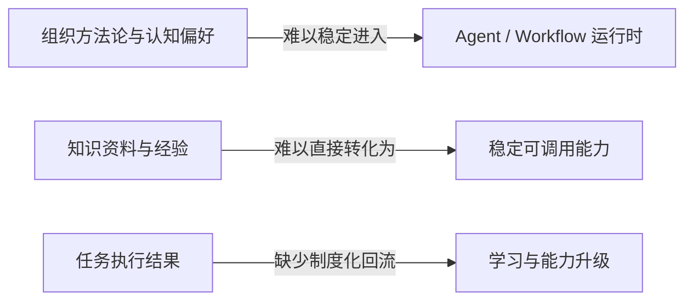
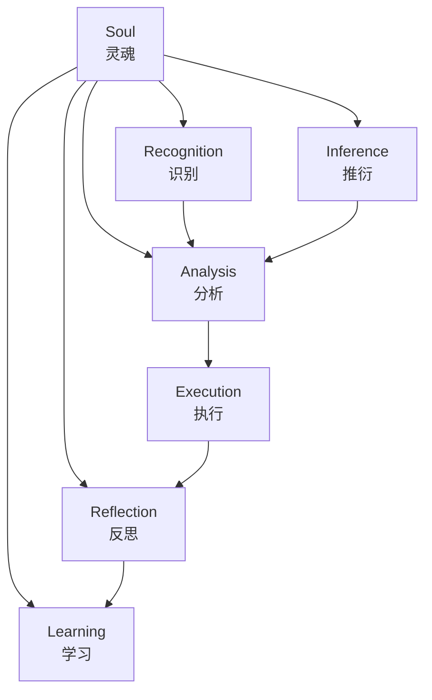
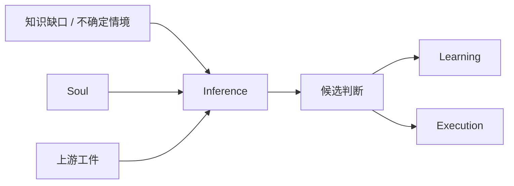
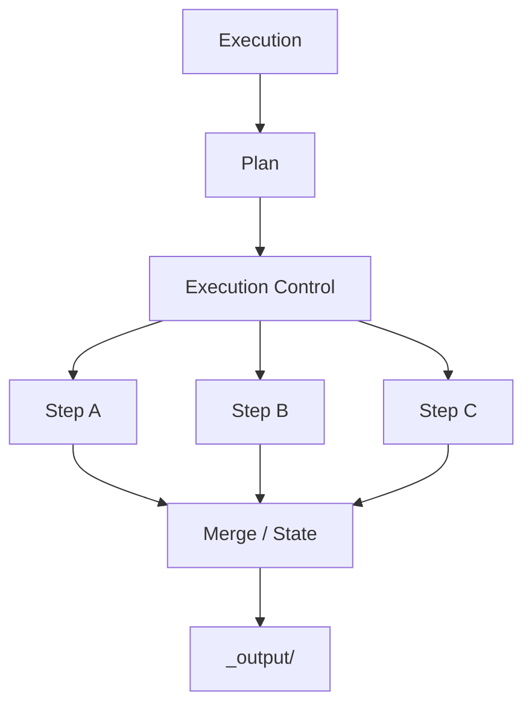
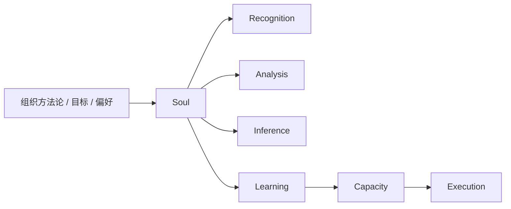

# 面向组织场景的 AI-Native 方法论与知识管理一体化框架研究

作者：Neil Wang（王唯力）

# 摘要 {.unnumbered}

在组织场景中，现有人工智能系统虽已具备较强的任务执行能力，而在方法论继承、知识沉淀、能力内化、目标一致性与可控自主演进诸方面，仍存显著断裂。为回应此一问题，本文提出一种面向组织场景的 AI 原生（AI-native）方法论与知识管理一体化框架。其要旨，在将人工智能系统理解为受高层约束所统摄的认知主体，并以两条互补主线支撑其运行。一为以心智模型为中心的数字人格架构，用以承载组织方法论、认知偏好与长期目标。二为以能力自治、动态规划与反思学习为中心的执行架构，用以将知识转化为能力，并驱动任务求解。本文进一步将心智主体界定为由灵魂、识别、分析、执行、反思、学习与推衍诸层构成的核心认知结构，讨论软件工程作为知识工程以及知识可执行的结构含义，并以 MindFlow 作为实践样本，结合流程建模、工程化实践与范式比较展开论证。研究显示，数字人格化认知结构、能力自治执行结构与知识管理闭环，惟有统一于同一体系之中，人工智能系统方可能获得可控、有目标导向且可持续自我修正的自主决策与学习能力。

# 关键词 {.unnumbered}

AI-Native；方法论；知识管理；知识工程；心智模型；数字人格；自主决策；自主学习

# 引言

大语言模型推动的软件形态变化，并不只体现为生成能力增强，更关乎知识、认知与执行三者关系之重组。传统软件系统，大抵通过预定义功能、固定界面与刚性流程来封装知识；而当前大量 Agent 系统，则尝试将模型能力嵌入任务流程，使其具备更强的自动化与交互能力。然而此类系统一旦进入组织场景，其不足亦随之显现。系统固然可以完成任务，却未必真正继承了组织的方法论；固然可以读取知识，却未必能将其稳定沉淀为能力；固然能在局部任务中显出智能，却未必能于长期运行中保持目标一致、方法稳定与可控演进。

上述问题之关键，不在模型能力是否继续增强，而在现有系统设计往往将知识、执行、学习与治理分而治之。许多工作流式 Agent 系统所关注的，多在任务之完成，而较少深究高层方法论如何进入运行时；许多知识管理系统长于存储、检索与组织资料，却未能自然回答知识如何转化为执行能力；许多多智能体编排方案善于分解复杂任务，却每每缺少稳定之反思学习闭环。问题不在彼而在此。组织真正所需的，是能在组织约束之下持续学习、保持方向并沉淀能力的 AI。

因此，本文并不首先把问题界定为如何设计一个更强的 Agent 系统，而是将其界定为一个方法论问题。在组织场景中，如何构造一种能够把高层约束、认知偏好、知识管理、能力形成与任务执行统一起来的 AI 原生方法论。本文关注的，不是某个系统具备了多少模块，而是人工智能系统在何种方法论条件下才可能形成可控自主性。只有先回答人工智能的学习、判断、执行与演进应被如何理解，后续的系统设计、协议设计与产品实现才具有稳定基础。

本文的基本判断是，软件工程在更深层意义上本质上是一种知识工程。传统软件可以被看作知识经由流程化、结构化与功能封装后的表达形式；而在 AI 软件条件下，知识开始可以直接进入执行过程，并被 AI 调用，从而使知识可执行成为一种新的软件边界。其关键在于，知识之地位已由静态说明转向运行单元。围绕这一判断，本文试图回答如下问题：面向组织场景的 AI 系统，如何把数字人格化认知结构、能力自治执行结构、知识管理与任务闭环统一为一套可解释、可运行、可反思、可持续演进的方法论体系。

基于上述问题意识，本文的研究贡献主要体现在四个方面。第一，本文提出一种面向组织场景的 AI 原生方法论框架，并将其核心认知主体界定为由灵魂、识别、分析、执行、反思、学习与推衍七层构成的心智主体。第二，本文从数字人格化角度解释心智模型、灵魂与高层约束如何塑造系统的稳定认知偏好与长期方向。第三，本文从能力自治与动态规划角度解释知识如何经由学习、能力形成、计划生成与任务执行，转化为可持续的任务求解结构。第四，本文以后文所述实践样本为依托，通过主流程分析、机制建模、工程化实践与范式比较，论证该框架相较于普通 Agent workflow、传统 MAS 编排与传统知识管理系统的理论增量。

# 相关研究与问题提出

围绕本文主题，至少有四类研究传统与之密切相关。若欲说明本文何以成立，先须辨明其所承与所未承。第一类是 Agent 与多智能体系统研究。相关综述表明，近期基于大语言模型的 autonomous agents 与 multi-agent systems 已经形成相对清晰的方法论讨论，包括任务分解、工具使用、协作结构与应用范式 [12][18]。然而，这一研究方向的重心通常放在代理如何完成任务、如何协作、如何使用工具，而较少将组织层面的高层约束、知识沉淀与长期自主演进作为统一问题展开。

第二类是知识管理与组织学习研究。相关研究长期指出，组织并不是通过简单存储资料来形成能力，而是通过知识筛选、保留、转移与嵌入稳定流程来产生价值 [8][10]。系统综述进一步表明，组织学习中的知识创建与获取过程，事实上已经在概念上被知识管理研究所吸收 [9]。这意味着，如果希望 AI 系统真正适配组织场景，就不能将知识管理视为外部附属模块，而应当把知识形成、审核、沉淀与能力化视为系统结构的一部分。

第三类是认知架构研究。认知架构传统强调，认知系统不应被理解为零散算法集合，而应被理解为多个认知过程之间的有机关联 [11][14][15]。这一视角对于本文具有重要意义，因为它提供了一种超越工程实现细节的表达方式，使心智主体可以被写成方法论核心体，而不是简单的目录树或模块列表。特别是当本文进一步讨论推衍、心智模型与数字人格时，认知架构传统有助于避免这些概念滑向泛泛而谈或修辞化表达。

第四类是知识工程与 AI 软件研究。知识工程的经典工作长期强调知识系统设计、知识库维护和知识表示的统一性 [6][7]。近期研究则进一步将软件工程与知识工程直接联系起来，提示软件系统的设计、维护与演进可以被重新理解为知识结构化与知识流动的问题 [17]。这一点为本文提出“软件工程本质上是一种知识工程”提供了直接理论支撑，也为“知识可执行”这一命题奠定了讨论基础。

尽管上述研究传统分别提供了多智能体协作、组织知识处理、认知系统设计与知识工程的丰富资源，但它们之间仍存在明显空白。Agent 研究缺少稳定的组织约束与能力沉淀视角；知识管理研究通常不直接处理 AI 系统如何把知识转化为执行能力；认知架构研究较少进入组织知识管理与软件工程语境；AI 软件研究则经常停留在工具或产品层，而缺乏上位方法论整合。本文的切入点正位于这些空白的交叉处。其目标不在另造一套术语，而在提出一种能够同时解释组织约束、知识沉淀、能力形成与执行闭环的方法论框架。

据此，本文将研究问题进一步收束为三个层次。第一，组织方法论、认知偏好与发展目标如何进入 AI 系统运行时，而不是停留在外部管理文件中。第二，知识如何从可检索对象转化为可执行能力，并在任务过程中持续沉淀。第三，系统如何在执行、反思与学习之间形成可治理的自我修正闭环。大体言之，若此三者不能并立，AI 系统便难被视为真正面向组织场景的方法论载体。

图 1 给出了本文的问题断裂示意。该图的意图不是概括所有既有研究，而是标出本文真正试图修复的三个结构性断口，即高层方法论约束难进入运行时、知识难内化为稳定能力，以及执行与学习之间缺少闭环。

图 1 现有主流范式中的三类结构性断裂

# 核心概念与理论命题

为了避免术语先行而定义滞后，本文先给出三个基础定义。第一，方法论并不是一般意义上的经验总结，而是指一套能够稳定规定系统如何判断、如何学习、如何执行、如何修正自身的原则结构。第二，组织场景是指任务执行、知识积累与能力演进都必须服从组织目标、边界条件与治理要求的应用情境。第三，可控自主性是指系统并非只会自动完成步骤，而是在高层约束下具备自主判断、自主学习、自主修正与持续保持方向一致性的能力。

在此基础上，本文将心智主体（Mind）定义为该方法论中的核心认知主体。心智主体是由灵魂（Soul）、识别（Recognition）、分析（Analysis）、执行（Execution）、反思（Reflection）、学习（Learning）与推衍（Inference）七层共同构成的认知结构。上述七层分别承担高层约束、任务理解、问题拆解、行动实施、结果复盘、知识内化与受控推衍等职责，它们共同决定系统如何理解任务、如何形成判断、如何学习以及如何保持方向一致性。换言之，心智主体是一种方法论意义上的主体结构。

心智模型是本文最关键的概念之一。本文将心智模型界定为认知方法论偏好的形式化表达，它回答系统在不同情境下采用何种判断策略、如何在不确定性中进行取舍、偏好学习什么样的知识以及朝何种方向演进。灵魂正是心智模型中的最高约束部分，它承载组织的方法论原则、认知偏好、边界条件与发展目标，并由此为系统提供长期稳定的方向约束。在组织场景中，只有当什么算好结果、什么方法被偏好、什么不允许发生、什么值得学习这些问题被纳入心智模型并上升到灵魂之中，系统的学习与演进才可能保持目标一致性。

推衍（Inference）是本文另一必须单列讨论的概念。本文所说的推衍，并不是自由联想式推理，而是在灵魂约束下展开的自我可控推理机制。其意义，在于使系统即便面对知识不完整、路径不明或判断依据不足之情形，仍能在约束之中继续形成候选判断。其价值至少体现在四个方面。它能在知识不完整时维持连续决策，能为学习提供方向性判断，能支撑风险预判与路径比较，也能在未知条件下保持数字人格的一致性。没有推衍，系统只能在已知知识范围内机械执行；有了推衍，系统才具备在约束下继续前进的能力。

在此基础上，本文提出三个相互关联的核心命题。其一，软件工程本质上是一种知识工程 [6][7][17]。传统软件系统可以被理解为知识经过抽象、流程化、结构化和功能封装之后形成的执行形态。其二，在 AI 软件条件下，知识开始变得可执行。这里的知识可执行，不是指资料能够被搜索到，而是指知识可以直接进入运行过程，并成为 AI 可调用、可验证、可组合的执行单元。由此，知识不再只是支撑软件的静态说明层，而开始承担部分原本由固定代码封装承担的执行职责。其三，任何试图在组织场景中实现可控自主性的 AI 系统，都必须同时解决高层约束进入运行时、知识向能力转化以及执行结果回流学习机制这三个问题。

最后，本文将数字人格定义为一种具备约束、偏好、学习、推衍与持续演进能力的 AI 软件形态。这一概念并非修辞性的拟人化说法，而是指一种更接近认知主体的软件结构。与传统固定功能软件相比，这种系统并不只是被动响应输入，而是在组织场景约束下持续理解、判断、学习并形成长期稳定风格。

图 2 对心智主体七层结构及其内部关系进行了概括。该图的关键不在于展示目录树，而在于说明心智主体作为认知主体本身的整体结构。

图 2 心智主体七层及其内在关系示意

# 方法论框架与概念结构

从方法论角度观之，心智主体七层并不是若干模块之简单堆叠，而是一有机整体，彼此相制，亦彼此相生。灵魂规定系统之长期方向；识别与分析将外部任务转化为系统可理解、可处理的问题对象；执行将认知结果转化为行动；反思对行动结果加以再解释；学习将可保留内容沉淀为稳定知识，并进一步形成可供执行调用的能力单元；推衍则于知识未备之际提供判断能力。诸层之间，并非线性单向关系，而是共同构成一受约束之认知闭环。此处应分别观之。上层主约束，中层主判断，下层主执行与回流。此处所论之重点，不在任何具体实现的目录结构，而在此一方法论究竟如何规定 AI 主体于组织场景中思、学、行与自我修正之道。

首先，灵魂的位置决定了该框架与普通 Agent workflow 的本质差异。普通 workflow 往往在提示词、规则或人工习惯中隐含价值倾向，而本文提出的方法论要求将这些内容显式上升为一个可持续引用的约束层。这意味着偏好何种方法、允许何种学习路径、如何判断结果是否符合组织目标等问题，不再以零散、临时、口头化的形式散落在系统周围，而是成为系统结构本身的一部分。就此而论，灵魂之设，实为全篇方法论之归宿所在。

其次，识别与分析的组合说明任务理解不应被省略。很多 Agent 流程倾向于接收任务后直接调用工具或执行模板，但组织场景中的复杂任务往往要求先判断任务类型、复杂度、风险、知识缺口与能力需求，再进行问题拆解和路径设计。若缺少这一层，执行只能是局部自动化，而无法构成稳定的方法论行为。

再次，学习与能力形成的关系决定了该框架与传统知识管理系统的差异。组织知识管理研究早已表明，知识价值之得失，不在存储本身，而在它是否进入组织稳定流程并产生价值 [8][10]。本文的方法论将这一逻辑进一步推进。知识不仅要被保留，还要通过学习、审核与能力化过程，最终形成稳定可调用的能力。这一设计使知识管理不再只是文档归档，而成为执行能力生产机制的一部分。

最后，推衍的引入使该框架能够面对不确定性。组织场景中的任务很少完全处于知识完备状态，系统必须在知识缺口、风险与多路径选择中持续前进。若仅见其一端，则易将推衍误解为自由发挥；其实不然。本文的方法论要求，让推衍在灵魂与上游工件约束下形成候选判断，再由学习与后续执行对这些判断进行稳定化或修正。如此一来，系统既保留前进能力，又不至于失去治理边界。

图 3 受约束推衍机制示意

# 主流程与运行逻辑

从方法论角度看，一个受约束的认知主体在解决任务时，至少须历任务进入、知识读取、识别分析、执行规划、结果反思与再学习诸阶段。任务先经知识读取，再经识别、分析、执行与计划生成，最后由反思回到学习。整个流程不只是一张工程步骤表，更是对具备方法论约束的认知主体如何求解问题的一种形式化表达。

首先，任务并不是直接触发执行，而是先进入知识读取阶段。这一步意味着系统在行动之前，先读取灵魂以及已审核的正式知识。其理论意义在于，系统并非从零开始面对任务，而是总在一个已经被约束和积累的认知背景上展开。对组织场景来说，这等于把组织的方法论、历史经验与已批准知识明确纳入运行起点。

随后，识别与分析将任务从要求做什么转化为系统如何理解这件事。前者负责识别任务类型、复杂度、风险与能力需求，后者负责进行结构化拆解 [2]。这一环节使系统的后续行动不是凭空反应，而是在一定认知建模基础上展开。

在此之后，执行层产出正式计划，并据此组织后续行动 [5]。这里的一个重要特征在于，这套方法论并不要求所有步骤都串行进行。相反，只要具备显式的计划、状态文件和结果工件机制，复杂任务便可以在文件驱动和状态可审计的前提下并行展开与汇合 [5]。至于执行内部控制如何围绕计划推进步骤、维持状态并组织并行，将留待后文工程化实践部分再作展开。

更重要的是，学习并不只发生在任务开始之前。在分析或执行过程中，一旦系统发现知识不充分，便可能触发推衍与进一步学习。此时，推衍在高层约束下对未知部分作出候选判断，而学习则尝试将新知识纳入更稳定的知识结构。也就是说，系统的主流程虽然是正式的，但它允许认知上的动态回补。这一点使其更接近真实的人类问题解决过程，而不是僵硬的固定管线。

任务完成之后，系统必须由反思回到学习。反思并不是写总结，而是为了发现问题、识别值得学习的内容、发现能力缺口并强化认知与能力。这一步在理论上非常关键，因为它将一次性任务结果重新纳入长期学习机制，使系统不只是在做事，而且是在通过做事修正自己。也正因此，本文提出的主流程应被理解为一种认知闭环，而非简单的执行流水线。

图 4 主流程示意

# 知识可执行与 AI 软件新范式

如果将软件工程视为知识工程，那么传统软件的基本逻辑，大体可以概括如下。知识、规则、流程与判断被编码为稳定之功能封装，并通过程序执行转化为结果 [6][7][17]。在此结构下，知识与执行之间存在明显层级差异。知识通常以需求文档、设计文档、领域模型、业务规则等形式存在，而程序则作为知识的正式执行载体。知识固能指导执行，然知识本身通常并不直接执行。

AI 软件条件下出现的关键变化在于，知识开始跨越这一层级边界。知识不再只是“告诉程序该怎么做”，而是开始直接参与运行，甚至在某些情形下直接承担执行职责。本文将这种变化概括为知识可执行。它并不意味着代码完全消失，而意味着知识作为运行单位的地位显著提升，开始成为软件结构中的一等公民。

在这种变化之下，知识经由学习、审核与内化，逐步沉淀为稳定可调用的执行能力。换言之，知识不是停留在仓库里等待人类阅读，而是被内化为系统可以调用的能力结构。这一点与传统知识管理系统存在显著差异。后者通常强于组织、索引与检索，前者则进一步关注知识如何进入执行。

这里还需要进一步区分执行样式与稳定能力。在本文语境中，前者更接近一种可被调用的方法性操作单元，强调如何做；后者则更接近知识经过学习、筛选、审核与沉淀后形成的稳定能力结构，强调系统已经真正具备了什么。前者可以被理解为知识进入执行的直接接口，后者则代表知识经过长期内化之后形成的较稳定能力形态。二者并不冲突，而是分别对应知识进入执行与知识沉淀为能力的两个侧面。

从软件形态角度看，此一变化之影响颇为深远。传统软件强调确定功能、稳定接口与固定执行逻辑，而 AI 软件正在引入一种以方法论约束、可执行知识与动态能力形成为基础的新结构。更好的 AI 软件，不应仅仅意味着自动化程度更高，而至少应具备四种特性。能于约束之下自主决策，能在目标牵引下持续学习，能把知识沉淀为稳定能力，亦能在反思中实现可控自我提升。惟其如此，AI 软件方可由会调用模型之工具，渐转为具备数字人格特征之认知软件系统。

当然，这里必须保持边界意识。本文并不宣称传统软件将立刻被 AI 软件全面替代，也不宣称固定执行封装会在短期内彻底消失。更稳妥的表述是，知识可执行提示了一种软件形态上的结构性转向。在某些知识密度高、任务不确定性强、组织目标约束显著的场景中，知识作为执行单元的重要性将持续上升，而以稳定能力、受约束推衍和闭环学习为基础的 AI 软件，可能成为一种越来越重要的系统形态。

图 5 知识内化与能力（Capacity）转化示意

# MindFlow 的工程化实践

MindFlow 在本文中承担的是协议化实践样本之角色 [1]。价值在将前文所述结构、流程与约束落实到正式工件、运行协议与执行路径之中。故本节重在说明这套方法如何被工程化。

工程化关键先在协议化。MindFlow 并不把高层约束、学习要求与执行规则停留在原则描述上，而是将其写入一套可重复执行的正式结构之中 [1][2][5]。从任务开始时的知识读取，到执行阶段的计划生成、状态维护与步骤推进，再到任务结束后的学习回流，均有固定工件与固定顺序可循。如此一来，前文所论之灵魂、学习、执行与反思，便不再只是概念上的分层，而开始获得可以被调用、检查与复用的工程形态。

这一工程化结构首先表现为前置学习的正式化。MindFlow 要求任务启动时先完成知识读取，并生成 `learning-read.md`，作为本次任务实际载入何种正式知识的审计记录 [5]。它一方面将灵魂与已批准知识明确纳入任务起点，另一方面也使后续识别、分析与执行不再建立在模糊的“似乎读过”之上，而是建立在可回看、可核验的知识基底之上。由此，前置学习不再只是经验动作，而被固定为运行链条中的正式环节。

其后，任务进入识别与分析，并由执行物化为正式计划。就蓝图定义而言，能力需求并不是在 `Step` 执行时临时匹配出来的，而是在前置识别、分析与计划生成阶段就已被确定 [2][5]。`plan.md` 不是一张粗略清单，而是对目标、步骤、主能力、调度方式与并行边界的正式表达。每一个 `Step` 都以计划为依据推进，并在计划中带有明确的能力字段与调度方式。故此，这里的执行是先经认知判断，再落实为可运行的结构。

按图 6 所示，执行内部控制围绕正式计划组织步骤推进，并在并行分支汇合后形成统一输出。这里尤应注意两点。其一，并行并非任意展开，而必须依据计划中既定的 `Dispatch Mode` 运作。其二，`Step` 虽是运行中的正式单元，但其所调用的主能力、所采用的调度方式以及是否可能触发补充学习，均在计划层已被预先规定。若在执行中发现能力不足，系统也并非任意越权，而是依既定链路先补学习、再沉淀能力、然后继续推进。就此而论，这一执行层天然具有多智能体系统特征，但它并不是为多智能体而多智能体，而是一种围绕 `Step` 组织、围绕能力分工展开、并能动态补足能力缺口的自主执行结构。

图 6 执行内部控制下的并行协作示意

工件化交接与显式状态维护，构成其第四个要点。任务画像、分析文稿、正式计划、步骤状态与结果目录，在这里都不是附属文档，而是运行过程本身的一部分。各步骤并不以临时上下文彼此传递，而是通过正式工件完成交接，并以 `state.md` 等状态文件维持运行状态 [5]。如此一来，系统既能减少隐式传递带来的漂移风险，又能将当前 phase、当前 step、分支状态与失败状态保持在可检查的范围之内。对复杂任务而言，这一点尤其重要。没有显式状态，动态规划便容易失其边界，执行链也更容易出现 context drift；没有正式工件，结果汇合与知识回流便难以稳定成立，注意力也容易在长链任务中发生 dispersion，并过早收束到局部可行解，形成 premature convergence。Formal artifacts 与 explicit state 的价值，正在于把这些原本隐性的运行风险，尽量收束到可观察、可校正的范围之内。

任务结束后的学习回流，使这一结构不止于完成任务，而能真正形成长期积累。MindFlow 并不把学习理解为简单归档，而是要求任务结束后按正式链路生成任务级学习记录、草稿知识、审核记录，并在必要时形成能力更新记录 [5]。只有通过审核并进入正式知识区的内容，才可能被后续任务稳定读取；只有完成能力更新的部分，才会进入可持续调用的能力层。由此，经验并不是留在一次性上下文中，而是有机会进入批准知识或能力变更之中。学习因此不再只是附在执行之后的总结，而成为知识转入长期记忆、再由长期记忆转入能力单元的正式机制。

综上，MindFlow 工程化地实践了一个以心智主体为中心、以学习与能力沉淀为支撑、以计划与状态控制为骨架的可运行结构。它一面围绕心智主体模拟稳定之认知与判断机制，一面又使学习及其所形成的能力单元获得持续运作的制度条件。故其意义，并不止于把任务做完，而在使前文所述数字人格结构、能力自治执行结构与知识管理闭环，真正落到运行层面。

\FloatBarrier

# 组织场景下的知识管理与自主演进

组织场景与个人使用场景的差异，在于前者必须持续面对目标一致性、知识保留、能力传承和长期治理问题。组织并不只是希望 AI 完成一次任务，而是希望 AI 形成稳定、可控、可与组织目标保持一致的长期行为结构。正因如此，组织方法论、认知偏好与发展目标必须进入系统的高层结构，而不能停留在项目说明、操作习惯或临时 prompt 中。

在这一结构中，灵魂承担的正是将这些高层内容显式化的职责。当组织的方法论原则、边界条件、学习策略和决策风格被写入灵魂后，系统对任务的识别、分析、推衍、反思与学习便不再是孤立局部行为，而是在长期目标约束下展开的认知过程。这意味着，自主学习在这里并不等于无约束自我扩张，而是一种被治理、被牵引的自主演进。

从知识管理角度看，这种结构更接近组织真正的需求。组织知识并不仅仅需要被存放和查询，更需要被筛选、审核、保留、转移并嵌入稳定流程 [8][10][13]。如果 AI 系统无法把知识转化为能力，就只能停留在会读资料的层面；如果它无法在组织约束下学习，就可能在长期运行中偏离目标。故知识管理在此并非外围基础设施，而是系统自我提升的核心部分。

图 7 组织场景约束传导示意

# 范式比较与讨论

若将本文方法论与普通 Agent workflow、传统 MAS 编排系统、传统知识管理系统及传统软件结构相较，可以发现其差异并不在采用了更多模块或更复杂的执行链条，而在是否真正统一了高层约束、认知结构、知识管理、能力形成与反思学习。尤应注意的是，比较之意不在争一时优劣，而在辨其结构之异同。

普通 Agent workflow 通常擅长把任务分解为若干执行步骤，但其高层约束往往隐含在 prompt 或人工习惯中，推衍与学习也常停留在局部即兴阶段。传统 MAS 编排系统可以更好地组织多能力协作，却未必自然解决知识沉淀、组织目标一致性与长期演进问题。传统知识管理系统在保存、检索与组织知识方面具有明显优势，但通常不直接处理知识如何成为执行能力。传统软件结构在执行可控性、稳定性与可审计性上仍然很强，但其知识大多通过固定代码封装，难以自然形成持续学习与动态能力化机制。就此而论，各有其长，亦各有其限。相比之下，本文提出的框架试图将数字人格化认知结构、能力自治执行结构与知识管理闭环统一到同一体系之中。

然亦须知，此一方法论并非可以通用于一切场景。对于低复杂度、知识耦合弱、目标变化小的问题，传统软件与简单 workflow 往往更为经济，亦更为直接。本文所述框架，更适合知识密度高、组织约束强、任务结构复杂且需要长期积累与演进的场景。故本文之结论，不在判断它可以全面优于他者，而在指出另一点。当问题本身要求把数字人格约束、知识管理、能力沉淀与执行闭环统一起来时，这套框架提供了一种更为完整、亦更适合组织场景的解释与设计路径。大体言之，这是因革之别，而非强弱之争。

# 局限性与未来工作

本文当前较为明确的局限，在于前文所述实践样本仍更接近一套协议化系统设计，而非已经封装成熟的通用自动执行平台。因此，本文更适合作为方法论与软件形态研究，而不宜被理解为现成产品之性能评测。

未来工作亦应与此局限相对应。其方向不在继续增加概念层次，而在推动这一协议化样本进一步走向稳定平台形态。更为紧要的一端，在于平台化过程中建立更清晰的治理边界与验证机制，从而使自主学习、能力沉淀与长期演进不止可被设想，亦可被持续管理与检验。

# 结论

本文要论证的是，面向组织场景的 AI 系统若要求得真正可控、有目标导向且能持续自我演进的自主能力，便不能仅止于任务执行层，而须将高层方法论约束、认知结构、知识管理、能力形成与反思学习统摄于同一体系。循此判断，本文提出了以心智主体为核心的 AI-native 方法论框架，并将其表达为由灵魂、识别、分析、执行、反思、学习与推衍七层构成的核心认知结构。

更进一步说，本文所讨论的软件工程作为知识工程，以及知识可执行之命题，所指向的并不是局部功能增强，而是一种软件形态上的转向。AI 软件正由静态说明的结构，转向可调用、可验证、可组合的执行单元。本文的核心贡献，正在于将两条关键主线归摄于一。其一为由心智模型、灵魂与推衍所支撑的数字人格化认知结构。其二为由学习、能力形成、计划生成与任务执行所支撑的能力自治与动态规划执行结构。前文之实践样本所显示者，正在于上述两条主线可以在组织约束之下统一于同一结构之中，并由此形成可持续学习、可审计执行与可控演进的 AI 软件形态。其得失所关，则是 AI 软件未来可能之形态。

# 参考文献 {.unnumbered}

[1] Wang W L. MindFlow[EB/OL]. GitHub. https://github.com/neilwangweili/MindFlow [2026-03-12].

[2] Wang W L. MindFlow: mind/README.md[EB/OL]. GitHub. https://github.com/neilwangweili/MindFlow [2026-03-12].

[3] Wang W L. MindFlow: mind/soul/README.md[EB/OL]. GitHub. https://github.com/neilwangweili/MindFlow [2026-03-12].

[4] Wang W L. MindFlow: mind/inference/README.md[EB/OL]. GitHub. https://github.com/neilwangweili/MindFlow [2026-03-12].

[5] Wang W L. MindFlow: tasks/README.md[EB/OL]. GitHub. https://github.com/neilwangweili/MindFlow [2026-03-12].

[6] Debenham J. Knowledge Engineering: Unifying Knowledge Base and Database Design[M]. Berlin: Springer, 1998.

[7] Kendal S L, Creen M. An Introduction to Knowledge Engineering[M]. London: Springer, 2007.

[8] Hall M. Knowledge management: A model for organizational learning[J]. International Journal of Accounting Information Systems, 2002, 3(2): 111-123.

[9] Örtenblad A. Is organizational learning being absorbed by knowledge management? A systematic review[J]. Journal of Knowledge Management, 2018, 22(2): 299-325.

[10] Argote L. Organizational Learning: Creating, Retaining and Transferring Knowledge[M]. New York: Springer, 2006.

[11] Varma S. The subjective meaning of cognitive architecture: a Marrian analysis[J]. Frontiers in Psychology, 2014, 5: 440.

[12] Wang X, et al. Large Language Model Agent: A Survey on Methodology and Applications[EB/OL]. OpenReview, 2025[2026-03-11].

[13] Nonaka I. A Dynamic Theory of Organizational Knowledge Creation[J]. Organization Science, 1994, 5(1): 14-37.

[14] Anderson J R, Bothell D, Byrne M D, et al. ACT-R: A cognitive architecture for modeling cognition[J]. Behavioral and Brain Sciences, 2004, 27(6): 1036-1060.

[15] Laird J E, Newell A, Rosenbloom P S. Soar: an architecture for general intelligence[J]. Artificial Intelligence, 1987, 33(1): 1-64.

[16] Park J S, O'Brien J C, Cai C J, et al. Generative Agents: Interactive Simulacra of Human Behavior[C]//Proceedings of the 36th Annual ACM Symposium on User Interface Software and Technology. New York: ACM, 2023.

[17] Menzies T, Kalinowski M, Mujtaba S, et al. From Data to Knowledge Engineering in Software Engineering[J]. IEEE Software, 2022.

[18] Xi Z, Chen W, Guo X, et al. A Survey on Large Language Model based Autonomous Agents[J/OL]. Frontiers in Artificial Intelligence, 2025[2026-03-11].
